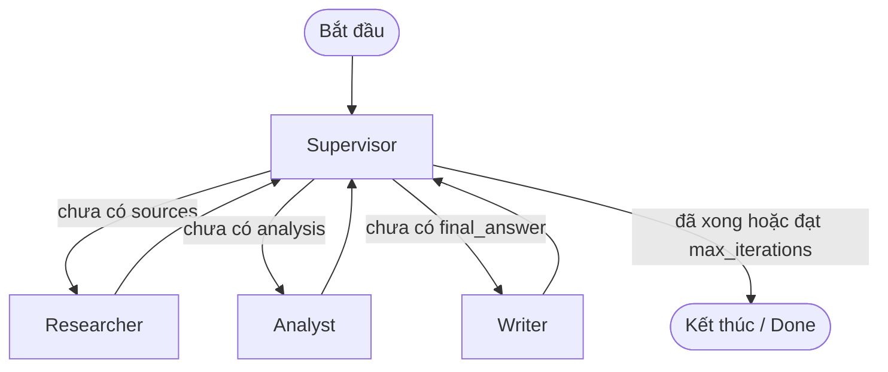

# Design Template: Multi-Agent Research System

## Problem

Xây dựng hệ thống Research Assistant tự động hóa quy trình tìm kiếm, thẩm định, phân tích đa chiều và tổng hợp báo cáo nghiên cứu kỹ thuật có trích dẫn nguồn rõ ràng theo câu hỏi của người dùng.

## Why multi-agent?

Single-agent (zero-shot LLM call) gặp các giới hạn lớn:
1. **Kiến thức tĩnh & Hallucination**: Không có cơ chế tự tra cứu web/tài liệu ngoài hoặc dễ bịa nguồn dẫn chứng.
2. **Context Overload**: Khi một prompt duy nhất phải vừa search, vừa tổng hợp, vừa phản biện, chất lượng từng phần giảm sút.
3. **Thiếu phản biện & kiểm chứng độc lập**: Multi-agent cho phép phân tách vai trò: Researcher chuyên thu thập, Analyst chuyên mổ xẻ mâu thuẫn/độ tin cậy, Writer chuyên chấp bút tổng hợp có citation, và Supervisor điều phối linh hoạt.

## Agent roles

| Agent | Responsibility | Input | Output | Failure mode |
|---|---|---|---|---|
| Supervisor | Điều phối thứ tự thực thi, kiểm tra điều kiện dừng và chuyển giao state | `ResearchState` | Cập nhật `route_history`, quyết định next node | Routing loop vô hạn nếu thiếu stop condition |
| Researcher | Tìm kiếm tài liệu từ web (Tavily/Mock) và tóm tắt ghi chú thô | `state.request.query`, `max_sources` | `state.sources`, `state.research_notes` | Không tìm thấy nguồn phù hợp hoặc nguồn rác |
| Analyst | Đánh giá độ tin cậy, phân tích luận điểm, mâu thuẫn và giới hạn | `state.research_notes`, `state.sources` | `state.analysis_notes` | Phân tích hời hợt hoặc bỏ qua mâu thuẫn quan trọng |
| Writer | Tổng hợp câu trả lời hoàn chỉnh kèm trích dẫn số `[N]` | `state.research_notes`, `state.analysis_notes`, `state.sources` | `state.final_answer` | Bỏ quên citation hoặc bịa đặt ngoài các nguồn đã cho |
| Critic (Bonus) | Thẩm định tính chính xác, kiểm tra độ phủ citation và an toàn | `state.final_answer`, `state.sources` | Đánh giá & góp ý hiệu chỉnh | False positives trong fact-checking |

## Shared state

- `request`: Chứa `query`, `max_sources`, `audience` (yêu cầu đầu vào bất biến).
- `iteration`: Bộ đếm vòng lặp để chặn infinite loops.
- `route_history`: Danh sách lịch sử điều phối của Supervisor.
- `sources`: Danh sách `SourceDocument` thu thập được từ bước tìm kiếm.
- `research_notes`: Ghi chú sơ bộ từ Researcher.
- `analysis_notes`: Báo cáo phân tích chuyên sâu từ Analyst.
- `final_answer`: Báo cáo tổng hợp cuối cùng từ Writer.
- `agent_results`: Metadata (token, cost, latency) của từng agent.
- `errors`: Danh sách lỗi phát sinh để Supervisor kích hoạt cơ chế dừng an toàn.

## Routing policy

## Guardrails

- **Max iterations**: Giới hạn tối đa (mặc định: 6) để chặn loop vô hạn.
- **Timeout**: Timeout trên từng request HTTP/LLM (60s).
- **Retry/Fallback**: Tự động fallback sang Mock Sources nếu Tavily search gặp lỗi kết nối hoặc thiếu API key.
- **Validation**: Kiểm tra schema đầu vào với Pydantic `ResearchQuery` (min length 5).
- **Error containment**: Bắt exception tại từng node trong LangGraph và ghi vào `state.errors`, giúp Supervisor dừng an toàn.

## Benchmark plan

| Query | Metric | Expected Outcome |
|---|---|---|
| "Research GraphRAG state-of-the-art" | Latency, Cost, Quality, Citation Coverage, Failure Rate | Baseline nhanh (~4s, ít token) nhưng không có citation; Multi-agent chậm hơn (~18s) nhưng chất lượng 10/10, citation coverage >= 60%. |
| "What are the key differences between RAG and fine-tuning for LLMs?" | Latency, Cost, Quality, Citation Coverage | Multi-agent tổng hợp được cả các nghiên cứu so sánh mới nhất. |
| "Explain multi-agent AI architectures and their tradeoffs" | Latency, Cost, Quality, Citation Coverage | Phân tích rõ các mô hình Supervisor vs Peer-to-peer. |
