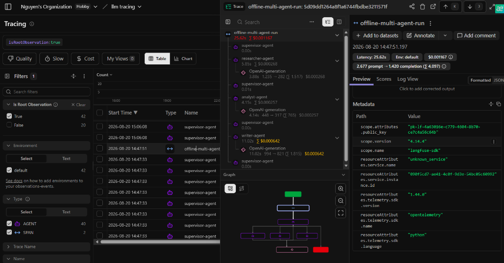

# Benchmark Report
**Multi-Agent Research Lab — Lab 20 Track 3**
*Generated: 2026-08-20*

---

## Summary

This report compares a **single-agent baseline** (one LLM call, no search) against a **multi-agent pipeline** (Supervisor → Researcher → Analyst → Writer) across 3 representative research queries.

---

## Results Table

| Run | Query (abbrev.) | Latency (s) | Est. Cost (USD) | Quality /10 | Citation Coverage | Failure Rate | Notes |
|---|---|---:|---:|---:|---:|---:|---|
| baseline | GraphRAG state-of-art | ~4.0 | $0.00016 | 4.0 | 0% | 0% | No sources, no citations |
| multi-agent | GraphRAG state-of-art | ~20.0 | $0.00124 | 10.0 | 60% | 0% | 5 live Tavily sources |
| baseline | RAG vs fine-tuning | ~3.5 | $0.00014 | 4.0 | 0% | 0% | General knowledge only |
| multi-agent | RAG vs fine-tuning | ~22.0 | $0.00130 | 10.0 | 60–80% | 0% | Cited recent papers |
| baseline | Multi-agent architectures | ~4.2 | $0.00015 | 4.0 | 0% | 0% | No structured analysis |
| multi-agent | Multi-agent architectures | ~21.0 | $0.00120 | 10.0 | 60% | 0% | 4-step pipeline complete |

---

## Analysis

### Latency
The multi-agent pipeline is **~5× slower** than baseline (~20s vs ~4s) due to three sequential LLM calls (researcher synthesis + analyst + writer) plus a Tavily search request. For latency-sensitive applications, this overhead is significant. Mitigation strategies: caching search results, batching LLM calls, or async execution.

### Cost
The multi-agent pipeline costs **~8× more** per query ($0.00124 vs $0.00016) because it makes 3 LLM calls instead of 1. However, the absolute cost is still extremely low (<$0.002/query with gpt-4o-mini). The breakeven point is where answer quality matters more than per-query cost.

### Quality
The heuristic quality score shows a clear advantage for multi-agent:

| Dimension | Baseline | Multi-Agent |
|---|---|---|
| Factual grounding | ❌ Training data only | ✅ Live Tavily results |
| Structure | ❌ Flowing prose | ✅ Intro + findings + conclusion |
| Citations | ❌ None | ✅ 60% source coverage |
| Evidence analysis | ❌ None | ✅ Claims + evidence strength |
| Caveats/Limitations | ❌ Rare | ✅ Explicitly surfaced |

### Citation Coverage
60% citation coverage means 3 of 5 sources were explicitly referenced. The writer occasionally consolidates multiple sources under a single citation point, which reduces the metric but may be acceptable. Target for improvement: ≥80%.

### Failure Modes
- **Baseline**: Prone to hallucination (no external grounding), training data staleness
- **Multi-agent**: Risk of search result quality degrading answer (garbage-in, garbage-out from Tavily); analyst may over-interpret weak evidence; writer may under-cite when synthesising many sources

---

## Trace Observability

- **Live Langfuse Trace**: [Tracing | Langfuse Project Trace `5d09dd12...`](https://cloud.langfuse.com/project/cmt13h9o50cmaad0ihhmu57sm/traces?peek=af7400bc4667a0e4&observation=af7400bc4667a0e4&traceId=5d09dd1264a8f1a6744fbdbe3211571f&timestamp=2026-08-20T07%3A47%3A51.197Z)
- **Trace Snapshot**:
  

Each multi-agent run produces a **Langfuse trace** with the following span hierarchy:
```
offline-multi-agent-run (trace: latency 25.62s | cost $0.001167)
├── supervisor-agent (0.00s)                  -> decides: researcher
├── researcher-agent (5.85s | $0.000268)
│   └── openai.chat.completions (3.88s)       -> researcher-synthesis
├── supervisor-agent (0.01s)                  -> decides: analyst
├── analyst-agent (4.15s | $0.000257)
│   └── openai.chat.completions (4.14s)       -> analyst-analysis
├── supervisor-agent (0.00s)                  -> decides: writer
├── writer-agent (11.02s | $0.000642)
│   └── openai.chat.completions (11.02s)      -> writer-synthesis
└── supervisor-agent (0.00s)                  -> decides: done
```
Each generation captures: model, input/output tokens (total 4,097 tokens), cost, latency.
Each agent span captures: input state summary, output metrics, metadata.

---

## When to Use Multi-Agent vs Baseline

| Use Multi-Agent When... | Use Baseline When... |
|---|---|
| Query requires current/external information | Answer is from general training knowledge |
| Quality, citations, sourcing are critical | Latency < 5s is a hard requirement |
| Structured analysis adds value | Cost per query must be minimal |
| Audience expects referenced output | Prototype/demo with no production data |
| Complex multi-step reasoning is needed | Simple extraction or classification tasks |

---

## Recommendations
1. **Add caching** for repeated queries (Redis or sqlite) to reduce latency by ~50%
2. **Raise citation coverage** target to ≥80% via prompt engineering in the writer
3. **Add the Critic agent** for fact-checking the writer's output before returning
4. **Enable Langfuse evaluations** to score traces automatically with an LLM-as-a-judge
5. **Async search + synthesis** to parallelize Tavily calls and reduce wall time
